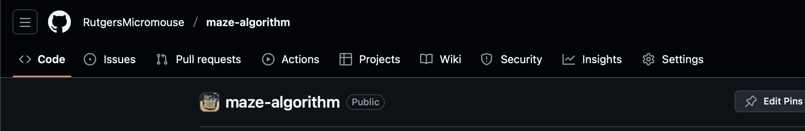
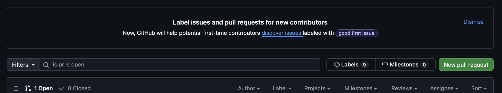
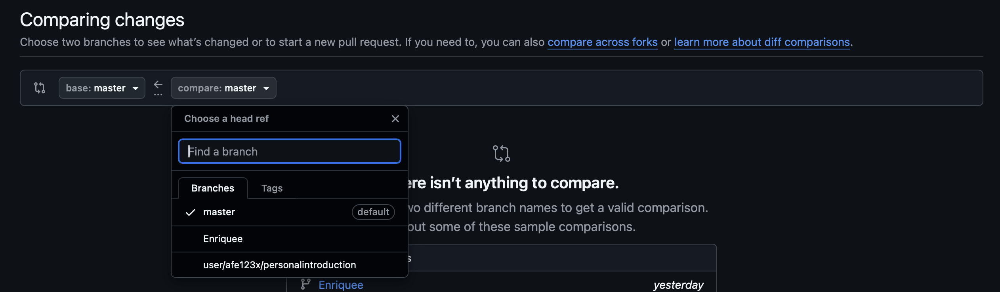
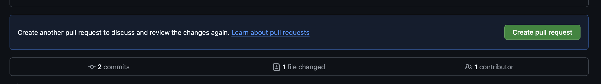

# Introductory Git Workshop

In order to do work on the micromouse repositories, you'll need to complete this workshop, and sucessfully finish all exercises

## Task

- You'll create a branch off master, add a script introducing yourself (your name, github handle, a little bit about yourself).
- You'll then commit, and push the changes.
- Finally, you'll make a Pull Request
- Upon accepting, and merging, you'll then be granted collaboration access on micromouse


## review

### creating a branch

- to make a branch, you do `git branch <branch name>`
- to start working in the branch, you'd do `git checkout <branch name>`

### pushing a branch

- If you're pushing a new branch to github, you want to do the following

```sh
git push -u origin <branch-name>
```


- If your branch is already on github, you can do

```sh
git push # you only need -u for the first push after making branch.
```

### making Pull Request

**step one**: Navigate to the pull request tab



**step two**: press "New pull request"



**step three**: select your branch in compare



**step four**: create new pull request

